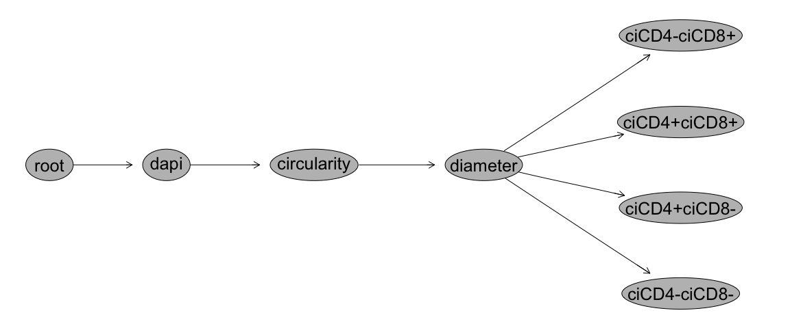
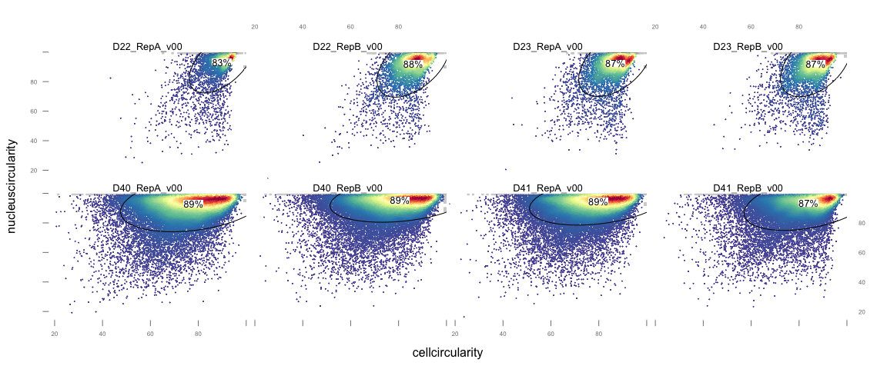
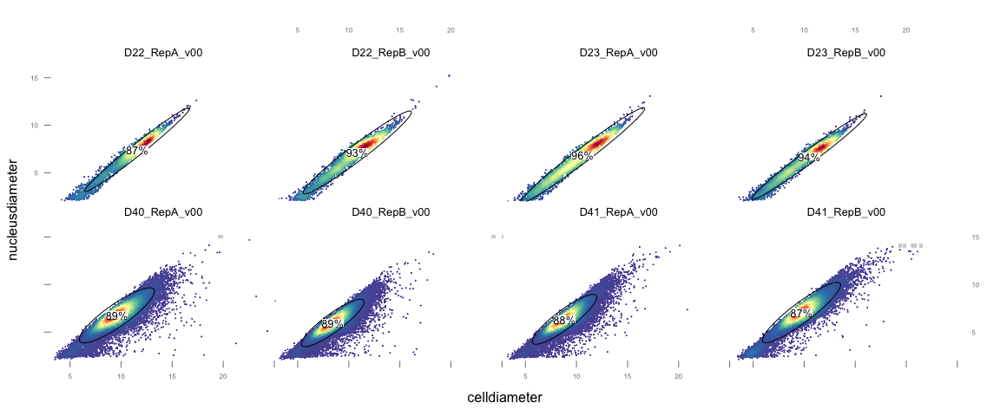
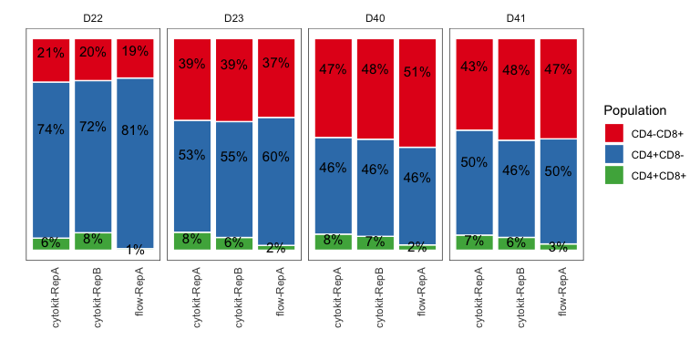
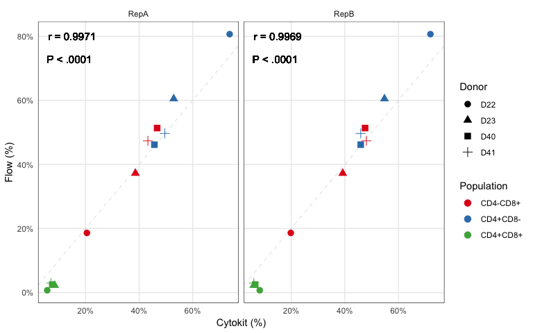
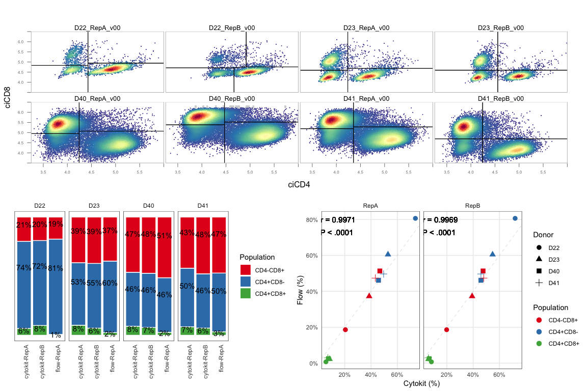

Cytokit Cellular Marker Profiling
================

This analysis contains the gating workflow used to process 8 pan-T Cell imaging experiments as well as a comparison of the size of the inferred CD4+ and CD8+ populations to results from a flow cytometer.

``` r
library(tidyverse)
library(flowCore)
library(openCyto)
library(ggcyto)

data_dir <- '/Volumes/disk1/cytokit/cellular-marker'

# Define experiment names and variants to run analysis for
experiments <- c(
  '20180614_D22_RepA_Tcell_CD4-CD8-DAPI_5by5',
  '20180614_D22_RepB_Tcell_CD4-CD8-DAPI_5by5',
  '20180614_D23_RepA_Tcell_CD4-CD8-DAPI_5by5',
  '20180614_D23_RepB_Tcell_CD4-CD8-DAPI_5by5',
  '20181116-d40-r1-20x-5by5',
  '20181116-d40-r2-20x-5by5',
  '20181116-d41-r1-20x-5by5',
  '20181116-d41-r2-20x-5by5'
)
variants <- c('v00')
```

Load Imaging Data
-----------------

First, generate metadata (`gsm` = "Gating Set Metadata") containing the sample (aka experiment) names, replicate identifiers, and "variants", where a variant corresponds to a Cytokit configuration used in processing.

``` r
gsm <- expand.grid(experiments, variants) %>% set_names(c('experiment', 'variant')) %>%
  mutate(path=str_glue('{data_dir}/{experiment}/output/{variant}/cytometry/data.fcs')) %>%
  mutate(donor=str_to_upper(str_extract(experiment, '[dD]\\d{2}'))) %>%
  mutate(replicate=str_extract(experiment, 'Rep[AB]|r[12]')) %>%
  mutate(replicate=case_when(
    replicate == 'r1' ~ 'RepA',
    replicate == 'r2' ~ 'RepB',
    TRUE ~ replicate
  )) %>% 
  mutate(sample=str_glue('{donor}_{replicate}_{variant}')) %>%
  as('AnnotatedDataFrame')
sampleNames(gsm) <- gsm@data$sample
gsm@data %>% knitr::kable()
```

|                | experiment                                     | variant | path                                                                                                                | donor | replicate | sample         |
|----------------|:-----------------------------------------------|:--------|:--------------------------------------------------------------------------------------------------------------------|:------|:----------|:---------------|
| D22\_RepA\_v00 | 20180614\_D22\_RepA\_Tcell\_CD4-CD8-DAPI\_5by5 | v00     | /Volumes/disk1/cytokit/cellular-marker/20180614\_D22\_RepA\_Tcell\_CD4-CD8-DAPI\_5by5/output/v00/cytometry/data.fcs | D22   | RepA      | D22\_RepA\_v00 |
| D22\_RepB\_v00 | 20180614\_D22\_RepB\_Tcell\_CD4-CD8-DAPI\_5by5 | v00     | /Volumes/disk1/cytokit/cellular-marker/20180614\_D22\_RepB\_Tcell\_CD4-CD8-DAPI\_5by5/output/v00/cytometry/data.fcs | D22   | RepB      | D22\_RepB\_v00 |
| D23\_RepA\_v00 | 20180614\_D23\_RepA\_Tcell\_CD4-CD8-DAPI\_5by5 | v00     | /Volumes/disk1/cytokit/cellular-marker/20180614\_D23\_RepA\_Tcell\_CD4-CD8-DAPI\_5by5/output/v00/cytometry/data.fcs | D23   | RepA      | D23\_RepA\_v00 |
| D23\_RepB\_v00 | 20180614\_D23\_RepB\_Tcell\_CD4-CD8-DAPI\_5by5 | v00     | /Volumes/disk1/cytokit/cellular-marker/20180614\_D23\_RepB\_Tcell\_CD4-CD8-DAPI\_5by5/output/v00/cytometry/data.fcs | D23   | RepB      | D23\_RepB\_v00 |
| D40\_RepA\_v00 | 20181116-d40-r1-20x-5by5                       | v00     | /Volumes/disk1/cytokit/cellular-marker/20181116-d40-r1-20x-5by5/output/v00/cytometry/data.fcs                       | D40   | RepA      | D40\_RepA\_v00 |
| D40\_RepB\_v00 | 20181116-d40-r2-20x-5by5                       | v00     | /Volumes/disk1/cytokit/cellular-marker/20181116-d40-r2-20x-5by5/output/v00/cytometry/data.fcs                       | D40   | RepB      | D40\_RepB\_v00 |
| D41\_RepA\_v00 | 20181116-d41-r1-20x-5by5                       | v00     | /Volumes/disk1/cytokit/cellular-marker/20181116-d41-r1-20x-5by5/output/v00/cytometry/data.fcs                       | D41   | RepA      | D41\_RepA\_v00 |
| D41\_RepB\_v00 | 20181116-d41-r2-20x-5by5                       | v00     | /Volumes/disk1/cytokit/cellular-marker/20181116-d41-r2-20x-5by5/output/v00/cytometry/data.fcs                       | D41   | RepB      | D41\_RepB\_v00 |

Next, load the FCS file for each experiment with special considerations for experiments where particular tiles were found to have large amounts of oversaturation:

``` r
load_fcs <- function(path, donor, replicate) {
  fr <- read.FCS(path, column.pattern='PHA', invert.pattern = TRUE)
  if (donor == 'D22' && replicate == 'RepB'){
    d <- exprs(fr)
    mask <- d[,'tilex'] < 4 | d[,'tiley'] > 2
    cat(sprintf('Removing %s rows of %s for file %s\n', sum(!mask), nrow(fr), path))
    fr <- Subset(fr, mask)
  }
  if (donor == 'D23' && replicate == 'RepB'){
    d <- exprs(fr)
    mask <- (d[,'tilex'] != 1 | d[,'tiley'] != 1) & (d[,'tilex'] != 1 | d[,'tiley'] != 2)
    cat(sprintf('Removing %s rows of %s for file %s\n', sum(!mask), nrow(fr), path))
    fr <- Subset(fr, mask)
  }
  fr
}

# Create a named list of flowFrames
fsr <- gsm@data %>% select(path, donor, replicate) %>% 
  pmap(load_fcs) %>% set_names(gsm@data$sample)
```

    ## Removing 949 rows of 6631 for file /Volumes/disk1/cytokit/cellular-marker/20180614_D22_RepB_Tcell_CD4-CD8-DAPI_5by5/output/v00/cytometry/data.fcs
    ## Removing 939 rows of 7794 for file /Volumes/disk1/cytokit/cellular-marker/20180614_D23_RepB_Tcell_CD4-CD8-DAPI_5by5/output/v00/cytometry/data.fcs

``` r
# Compile frames into single flowSet with appropriate metadata
fsr <- flowSet(fsr)
sampleNames(fsr) <- gsm@data$sample
phenoData(fsr) <- gsm

# Specify biexp transforms for CD4/CD8 only
chnl <- c("ciCD4", "ciCD8")
trans <- transformList(chnl, biexponentialTransform())
fst <- transform(fsr, trans)

# Initialize a gating set with the appropriate marker names
gs <- GatingSet(fst)
markernames(gs) <- fsr@colnames %>% set_names(fsr@colnames)
gs
```

    ## A GatingSet with 8 samples

Apply Gating
------------

Before trying to isolate CD4/CD8 cells, build a workflow that also uses the DAPI intensity and some cell morphology properties to remove cells that are likely the result of illumination artifacts or poor nuclei segmentation:

``` r
add_pop(
  gs, alias="dapi", pop="+", parent='root', dims='niDAPI,ciDAPI', 
  gating_method='flowClust.2d', gating_args="K=1"
)
add_pop(
  gs, alias="circularity", pop="+", parent='dapi', dims='cellcircularity,nucleuscircularity', 
  gating_method='flowClust.2d', gating_args='K=1'
)
add_pop(
  gs, alias="diameter", pop="+", parent='circularity', dims='celldiameter,nucleusdiameter', 
  gating_method='flowClust.2d', gating_args='K=1'
)
add_pop(
  gs, alias="*", pop="*", parent='diameter', dims='ciCD4,ciCD8', 
  gating_method='quadGate.tmix', gating_args="K=3"
)
recompute(gs)
plot(gs)
```



Resulting Populations
---------------------

Show all of the cell filtering populations leading up to the final CD4/CD8 isolation step:

``` r
flowWorkspace.par.set("plotGate", list(xlim = "data", ylim = "data"))
plot_gate <- function(node){
  plotGate(
    gs, node, layout=c(4,2), 
    par.settings=list(
      gate=list(col = "black", lwd=1),
      panel.background = list(col = "white"),
      strip.background = list(col = "white"),
      axis.text = list(cex = .5)
    ),
    xbin = 0,
    marker.only = TRUE,
    scales=list(alternating=TRUE)
  )
}
plot_gate('dapi')
```


``` r
plot_gate('circularity')
```



``` r
plot_gate('diameter')
```



Show quadrant gating on CD4/CD8 inferred via t mixture model:

``` r
nodes <- getNodes(gs, path=1)[5:8]
p_xy <- plotGate(
  gs, nodes, 
  stats=FALSE, 
  layout=c(4,2), 
  par.settings=list(
    gate=list(col = "black", lwd=1),
    panel.background = list(col = "white"),
    strip.background = list(col = "white"),
    axis.text = list(cex = .5),
    axis.line = list(col = 'gray')
  ),
  xlim = c(3.25, 6), ylim = c(3.5, 6.5), 
  xbin = 0,
  marker.only = TRUE,
  scales=list(alternating=FALSE)
)
p_xy
```


Comparison to Flow
------------------

Extract population statistics and merge with flow results:

``` r
# Variant to use for comparison, if there are multiple
variant_name <- 'v00'

# Extract counts for each population in the worfklow as well as associated metadata
df_ck <- getPopStats(subset(gs, variant==variant_name), statistic='freq', format='long') %>%
  mutate(percent=100*Count/ParentCount) %>% 
  filter(str_detect(Population, 'ciCD[4|8][\\+|\\-]ciCD[4|8][\\+|\\-]')) %>%
  rename(population=Population) %>%
  mutate(population=str_replace_all(population, 'ci', '')) %>%
  mutate(donor=str_extract(name, 'D\\d{2}')) %>%
  mutate(replicate=str_extract(name, 'Rep[A|B]')) %>%
  select(donor, population, percent, replicate) %>% 
  as.tibble
  
# Load flow 
df_flow <- read_csv('flow_stats.csv') %>% mutate(replicate='RepA')

df_stats <- bind_rows(
    df_ck %>% mutate(source='cytokit'), 
    df_flow %>% mutate(source='flow')
  ) %>%
  mutate(run=as.character(str_glue('{source}-{replicate}'))) %>%
  filter(population != 'CD4-CD8-') %>% 
  group_by(run, donor, source, replicate) %>% 
  mutate(percent=100*percent/sum(percent)) %>% ungroup %>%
  mutate(pct=str_glue('{p}%', p=round(percent, 0))) 

df_stats %>% head %>% knitr::kable()
```

| donor | population |    percent| replicate | source  | run          | pct |
|:------|:-----------|----------:|:----------|:--------|:-------------|:----|
| D22   | CD4-CD8+   |  20.524691| RepA      | cytokit | cytokit-RepA | 21% |
| D22   | CD4+CD8+   |   5.709877| RepA      | cytokit | cytokit-RepA | 6%  |
| D22   | CD4+CD8-   |  73.765432| RepA      | cytokit | cytokit-RepA | 74% |
| D22   | CD4-CD8+   |  19.833179| RepB      | cytokit | cytokit-RepB | 20% |
| D22   | CD4+CD8+   |   8.248378| RepB      | cytokit | cytokit-RepB | 8%  |
| D22   | CD4+CD8-   |  71.918443| RepB      | cytokit | cytokit-RepB | 72% |

Show percentage comparison as fraction of total (excluding double negative cells since there was no marker in this pan-T cell sample useful for separating these from non-T cells or gamma/delta T cells):

``` r
# Resize + screenshot + save at images/pub/flow_comparison.png
p_stat <- df_stats %>%
  ggplot(aes(x=run, y=percent, fill=population, label=pct)) +
  geom_bar(stat='identity', position='fill', color='white') +
  geom_text(size = 4, position=position_fill(vjust=.7)) +
  scale_fill_brewer(palette='Set1', guide=guide_legend(title='Population')) +
  scale_y_continuous(labels = scales::percent_format()) +
  facet_wrap(~donor, nrow=1) + 
  xlab('') + ylab('') +
  theme_bw() + theme(
    panel.grid.minor.x=element_blank(),
    panel.grid.minor.y=element_blank(),
    panel.grid.major.x=element_blank(),
    panel.grid.major.y=element_blank(),
    axis.ticks.x=element_blank(),
    axis.ticks.y=element_blank(),
    axis.text.y=element_blank(),
    strip.background = element_rect(colour="white", fill="white"),
    axis.text.x = element_text(angle = 90, hjust = 1)
  ) 
p_stat
```



Show scatterplot comparison:

``` r
p_scat <- inner_join(
  df_stats %>% filter(source == 'cytokit') %>% select(donor, population, replicate, percent),
  df_stats %>% filter(source == 'flow') %>% select(donor, population, percent),
  by=c('donor', 'population'),
  suffix=c('.cytokit', '.flow')
) %>% 
  ggplot(aes(x=percent.cytokit, y=percent.flow, color=population, shape=donor)) + 
  geom_point(size=3) + 
  geom_abline(slope=1, linetype='dashed', alpha=.1) + 
  scale_color_brewer(palette='Set1') +
  scale_y_continuous(labels=function(x) scales::percent(x, scale=1)) +
  scale_x_continuous(labels=function(x) scales::percent(x, scale=1)) +
  facet_wrap(~replicate, nrow=1) + 
  labs(x='Cytokit (%)', y='Flow (%)', shape='Donor', color='Population') + 
  theme_bw() + theme(
    panel.grid.minor.x=element_blank(),
    panel.grid.minor.y=element_blank(),
    axis.ticks.x=element_blank(),
    axis.ticks.y=element_blank(),
    strip.background = element_rect(colour="white", fill="white")
  ) 
p_scat
```



Arranged Figures
----------------

For publication:

``` r
gridExtra::grid.arrange(grobs=list(p_xy, p_stat, p_scat), layout_matrix=rbind(c(1, 1), c(2, 3)))
```


