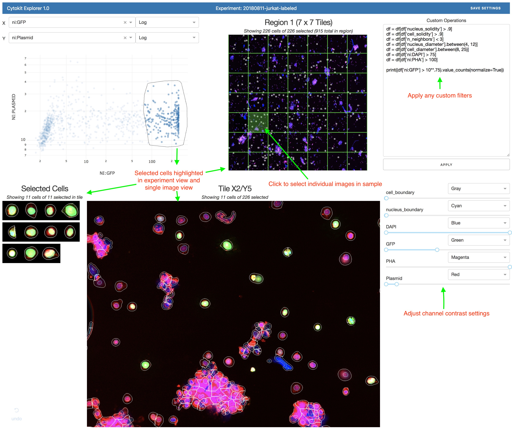
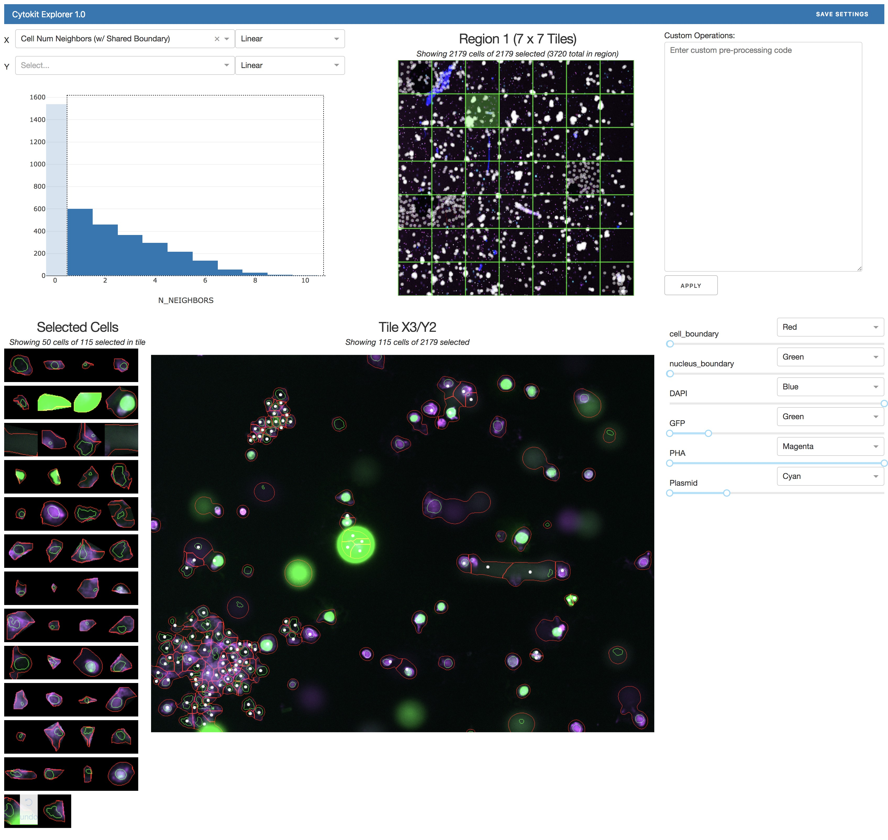
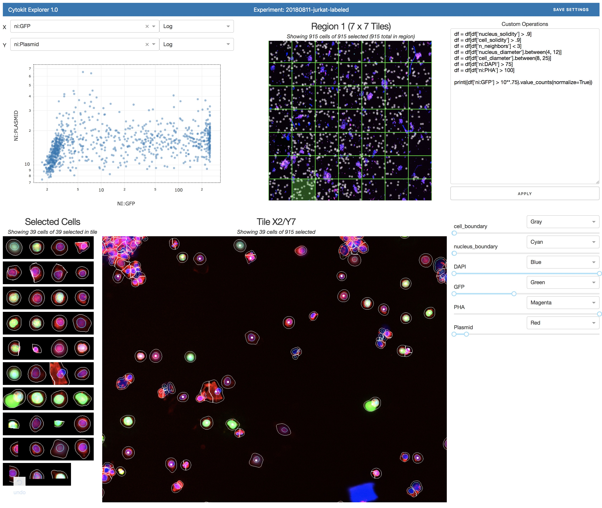

# Cytokit Explorer

The purpose of this application is to provide some high-level analysis of a sample through 
filtering operations on cell subsets.  This is most helpful for identifying unexpected global patterns, 
checking segmentation accuracy, or informing a more programmatic analysis.

As a [Dash](https://plot.ly/products/dash/) application, it can support visualization of tens of 
thousands of cells with little latency, a noticable latency with hundreds of thousands of cells, and
is inoperable with millions of cells (though configurable sampling rates are provided to ensure
that everything is fairly snappy by default).

Configuration for the app currently involves setting environment variables, with at least values for the following variables set:

```bash
export APP_EXP_NAME="20180101_codex_spleen"
export APP_EXP_DATA_DIR=/lab/data/20180101_codex_spleen/output/v01
export APP_EXP_CONFIG_PATH=/lab/data/20180101_codex_spleen/output/v01/config
```

See [config.py](https://github.com/hammerlab/cytokit/blob/54d56880413f1a89000056a1f2b9af1c590cf43e/python/applications/cytokit_app/explorer/config.py) for some other properties

\*TODO: Move configs to yaml and document properties

### Examples

#### Example 1: GFP Positive Jurkat Cells

This screenshot shows how GFP positive cells can be identified in a sample after applying a variety of custom 
filters:



#### Example 2: Isolating Unwanted Cells

This example shows a sample where the cell preparation resulted in a clumping of many of the cells in a way 
that interfered with the target fluorescent dye measurements.  The selected cells here are restricted to 
those that directly contact at least one other cell (n_neighbors >= 1) and you can see how this is reflected 
in the images as highlights/dots on cells in clumps of some kind:




#### Example 3: Visualizing All Cells

This example simply shows all cells after applying custom filters, which is often a good way to see if 
there are any more filters worth applying through exploration of individual images and single cell
image patch extractions:


